# Sieci neuronowe

- Kurs: _Sztuczna Inteligencja i Inżynieria Wiedzy_
- Grupa: Poniedziałek, 17:05 - 18:50


## Przygotowanie danych

### Źródło danych
Dane pobrane zostały z [Jester](https://eigentaste.berkeley.edu/dataset/).
Plik z ocenami śmieszności zawiera oceny 
100 żartów od 24 983 użytkowników.
Teksty żartów znajdują się w osobnym folderze i są one w formacie _.html_.

### Wyodbrębnienie tekstu żartów
Rozpoczęto od wyodbrębnienia tekstu żartów z plików _.html_.
Wykorzystano bibliotekę _BeautifulSoup_ do parsowania plików.


### Przetworzenie danych
Z powodu dużej ilości danych 
oraz ograniczeń zasobów sprzętowych,
dla każdego żartu obliczono średnią / medianę, i na jej podstawie
dokonywano trenowania oraz testowania modeli.

_Próba użycia wszystkich danych została podjęta, jednak czas trwania nawet jednej epoki był długi. W związku z tym oraz niewielkim zyskiem informacyjnym zdecydowano się na użycie średniej / mediany._


## Zadanie 1
Do wygenerowania osadzeń wykorzystano 
model _bert-base-cased_ z modułu _sentence_transformers_.
Wygenerowane w ten sposób osadzenia zostały 
osadzone w ramce danych wraz z ocenami śmieszności (średnią / medianą).
Podział danych na zbiór treningowy i testowy wynosił 80% / 20%.
Nie użyto żadnego skalowania ani normalizacji danych, ponieważ 
osadzenia powinny być już znormalizowane.

## Zadanie 2
Wytrenowano model używając 1000 epok, 
korzystając z parametrów
```python
mlp = MLPRegressor(solver="sgd", alpha=0.0, learning_rate="constant")
```
Przeprowadzono trenowanie 
zarówno dla medianej jak i średniej.
Poniżej znajduje się wykres przedstawiający błąd średniokwadratowy
dla danych treningowych i testowych w zależności od liczby epok.

Wyniki dla mediany:

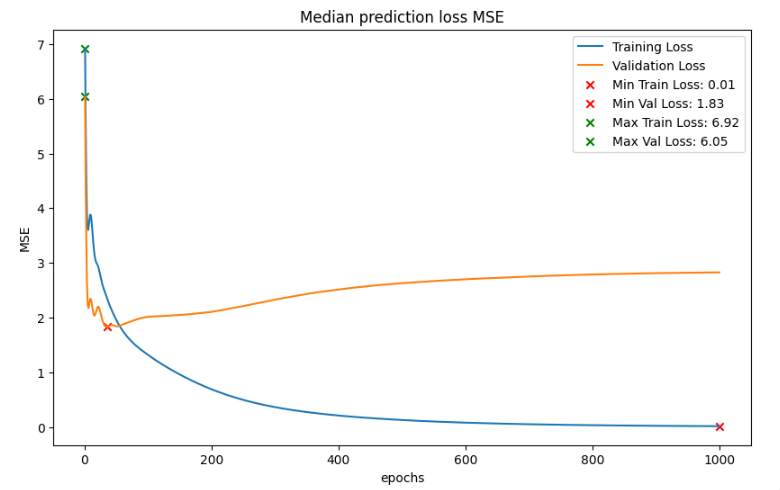


Wyniki dla średniej:

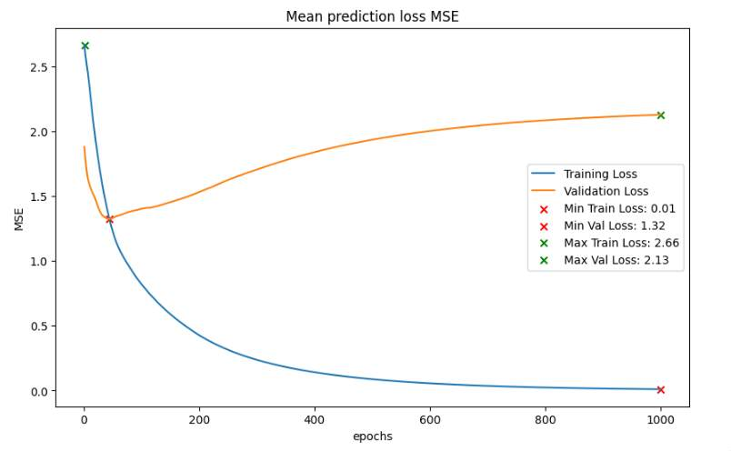


Można zaobserwować 
podobne zachowanie modelu dla obu przypadków.
Błąd średniokwadratowy jest mniejszy dla średniej ale wynika 
to z faktu, że średnia jest bardziej stabilna niż mediana.

W obu przypadkach model dopasowuje się bardzo dobrze do danych 
treningowych. Błąd dla danych treningowych konsekwentnie 
maleje wraz z liczbą epok, by w końcu osiągnąć wartość bliską zeru.

Jeśli chodzi o dane testowe, to model 
tylko przez pierwsze kilkadziesiąt epok 
jest w stanie zmniejszać błąd. Dzieje się 
to jednak konsekwentnie z epoki na epoke,
co wskazuje na to, że model jest w stanie
generalizować na nowe dane, nawet przy tak małej liczbie przypadków.

Po osiągnięciu minimimum, błąd zaczyna rosnąć,
co wskazuje na stopniowe przuczenie modelu.
Dla wykresu ze średnią, przekierowanie jest na tyle 
niekorzystne, że wyniki są stają się gorsze niż dla modelu losowego.

W dalszych etapach zdecydowano się na użycie mediany 
ponieważ wydaje się bardziej odpowiednia.

## Zadanie 3


W celu zbadania tempa uczenia 
testowano model na następujących parametrach
```python
learning_rates = [0.0001, 0.001, 0.005, 0.01, 0.05]
epoch_counts = [2000, 1000, 1000, 1000, 1000]
```
Dla najmniejszego tempa uczenia 
zdefiniowano większą liczbę epok,
ponieważ model potrzebuje więcej czasu na
osiągnięcie naukę.


#### Learning rate = 0.00001:
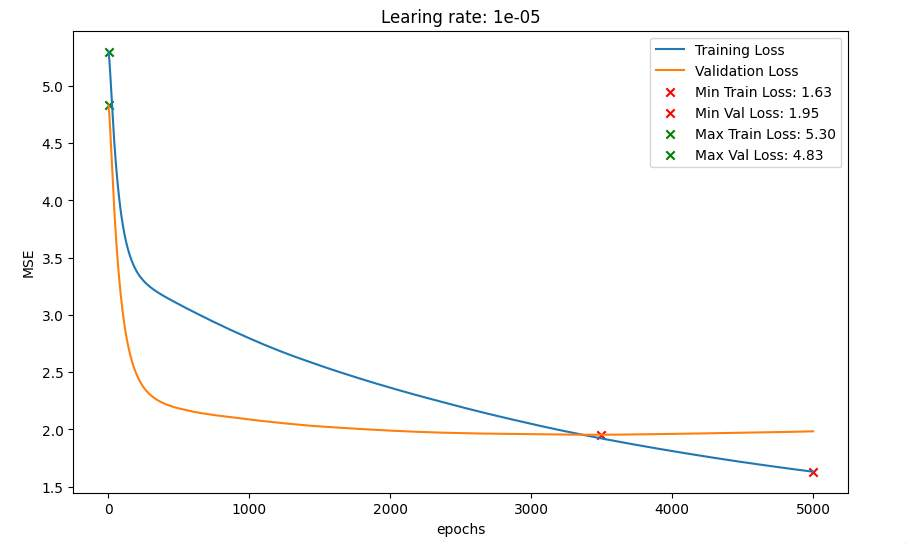

Model o tak niskim tempie uczenia
posiada bardzo płaskie krzywe uczenia.
Zarówno dla dnaych treningowych jak i testowych
model nawet po 5000 epok nie znalazł się 
w minimum. 

Dzięki temu wydaje sie dość odporny na przeuczenie
ale jednocześnie bardzo wolno się uczy.


#### Learning rate = 0.0001:

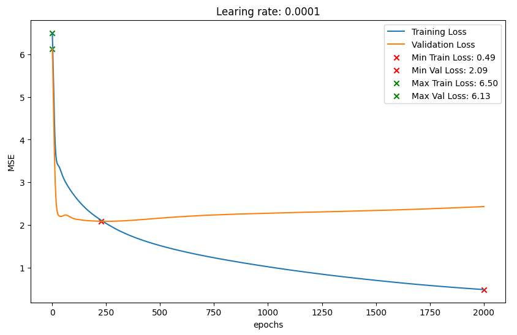

Jak widać model 
ładognie zmienia charakterystykę
zarówno dla danych treningowych jak i testowych.
Błąd konsekwentnie maleje wraz z liczbą epok.

Jeśli chodzi o dane testowe to model
osiąga minimum dopiero w okolicy 250 epoki - 
dużo później niż w przypadku domyślnego tempa uczenia, 
jednak znacznie szybciej niż w poprzednim przypadku.


#### Learning rate = 0.001:
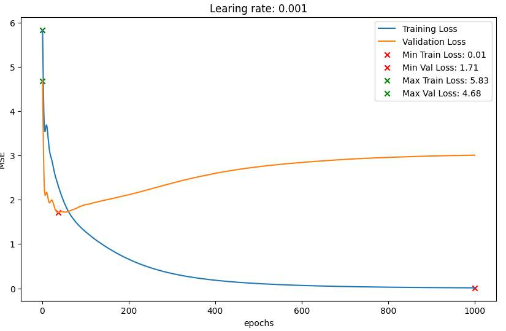

Model osiągnął minimum dla danych testowych 
już przed 50 epoką. Przeuczenie jest dużo bardziej widoczne
niż w przypadku mniejszego tempa. 
Model jednak dalej jest dość stabiliny.

#### Learning rate = 0.005:
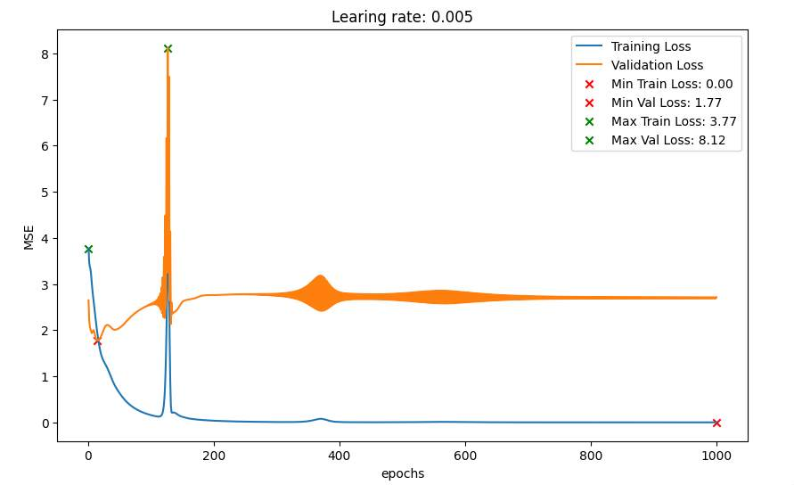

Model szybko osiąga minimum dla danych treningowych.
Przeuczenie jest jednak bardzo widoczne.
Błąd na zbiorze testowym jest jednak 
bardzo wysoki. 

Warto również zauważyć intenstywne oscylacje 
błędu dla obu danych.


#### Learning rate = 0.01:
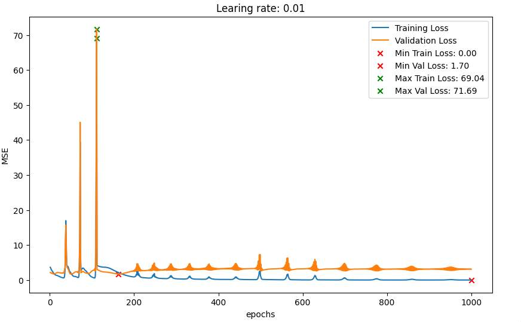

Model staje się bardzo niestabilny.
Nie jest w stanie nawet poradzić sobie z danymi
treningowymi. Błąd na zbiorze testowym jest
bardzo wysoki.

### Podsumowanie 
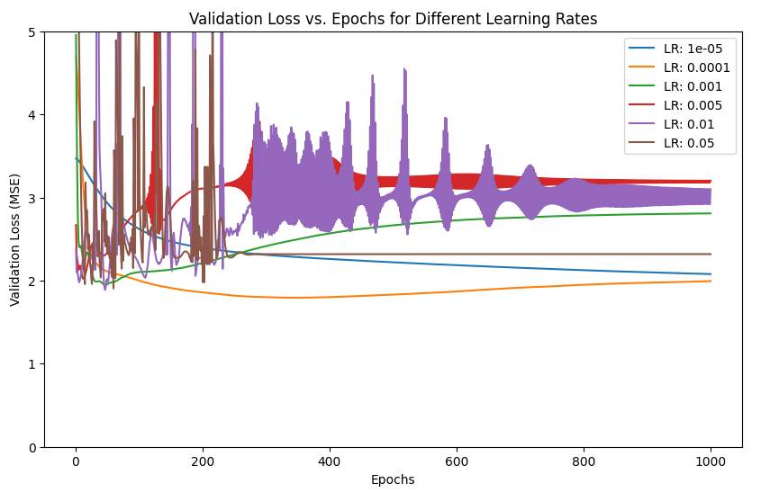

Przeuczenie jest dużo intensywniejsze
dla większych temp uczenia.
W skrajnych przypadkach prowadzi do
bardzo niestabilnych modeli, które
mają tendencję do dużych oscylacji i nie są 
w stanie dobrze poradzić sobie z danymi testowymi.

Modele o za niskim tempie uczenia są
bardzo stabilne, ale jednocześnie bardzo wolno się uczą i często nie 
są w stanie osiągnąć odpowiednich wag.

Dość dobrym kompromisem wydaje się być w tym wypadku tempo uczenia 0.0001 oraz 0.001,
które jest domyślną wartością dla modelu _MLPRegressor_.

## Zadanie 4
Sprawdzono następujące rozmiary warstw ukrytych:
```python
layer_sizes = [5, 20, 50, 300,1000]
```

#### hiden\_layer\_sizes = 5:
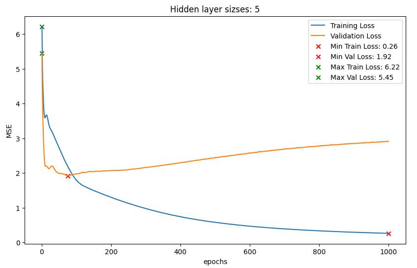

#### hiden\_layer\_sizes = 20:
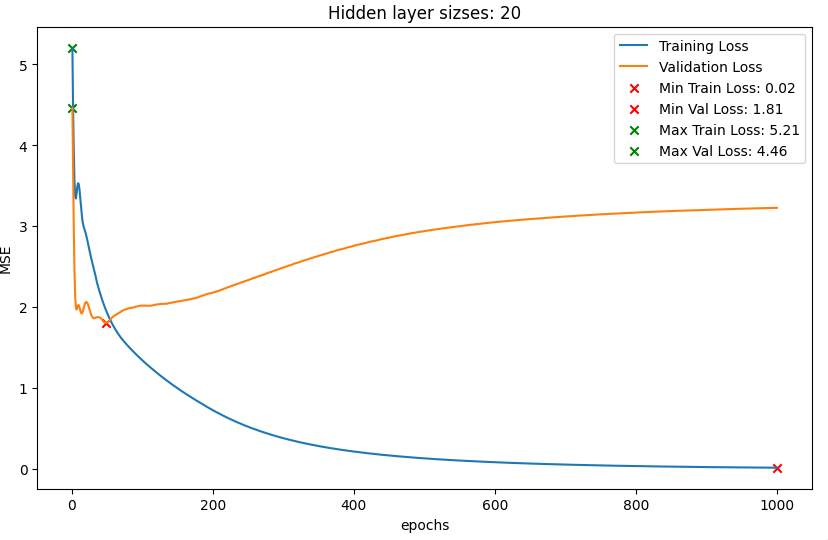

#### hiden\_layer\_sizes = 50:
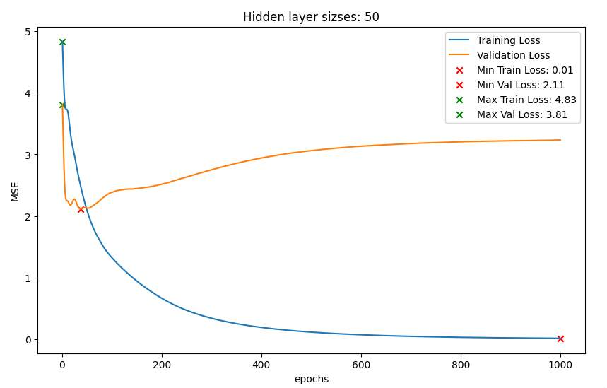

#### hiden\_layer\_sizes = 300:
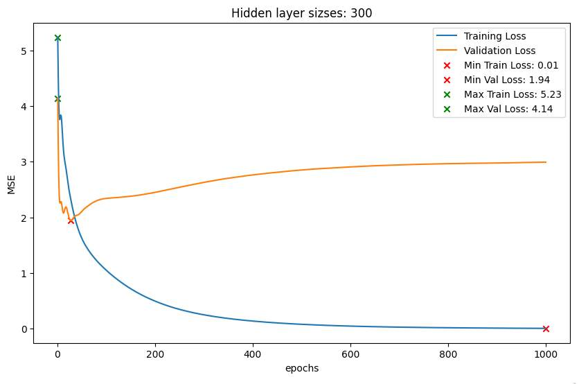

#### hiden\_layer\_sizes = 1000:
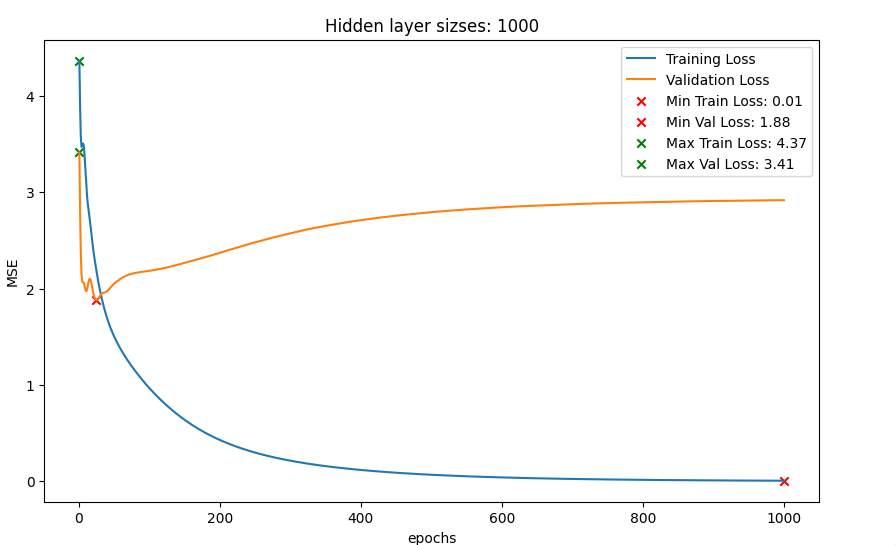

### Podsumowanie 
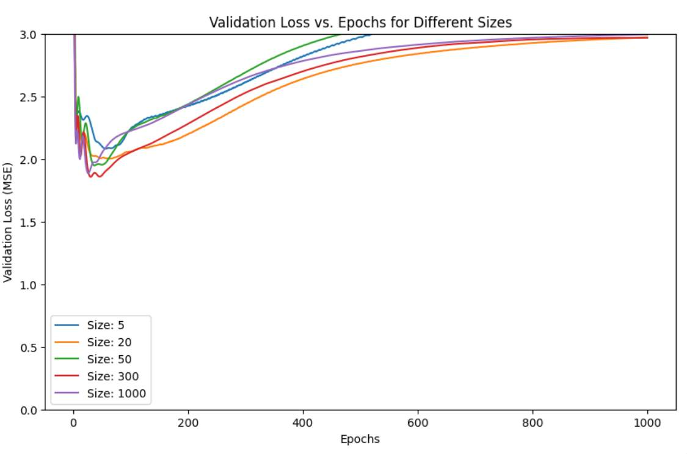

Nie zaobserwowano wyraźnych zależności 
między liczbą neuronów w warstwie ukrytej a błędem modelu.
Wszystkie modele dopasowały się bardzo dobrze do danych treningowych.

Jeśli chodzi o efekt przeuczenia, to wystąpił on 
dla wszystkich modeli, i dla każdego z nich wystąpił 
w podobnej epoce. Nachylenie krzywej błędu po przeuczeniu również jest podobne.

Wydaje się że duża wartswa neuronów w warstwie ukrytej
powinna prowadzić do przeuczenia, jednak 
w tym przypadku _nie_ zaobserwowano takiej zależności.

## Zadanie 5
Jako najlepszy model wybrano model z następującymi parametrami:
```python
mlp = MLPRegressor(solver="sgd", alpha=0.0, learning_rate="constant", learning_rate_init=0.0005,
	hidden_layer_sizes=(100,))
```

Następnie model wytrenowano na danych treningowych 
dla 100 epok (taka liczba wydaje się końnczyć przed przeuczeniem).

Dzięki łagodnej krzywej 
postarano się uniknąć przeuczenia modelu.

Tak sprawuje się wykorzystany model na 
danych ze zbioru:
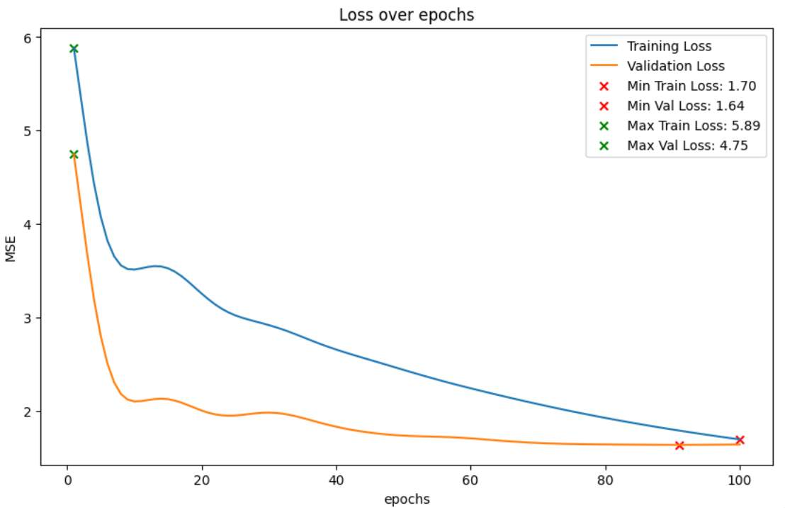

Jak widać model w okolicach setnej epoki
zaczyna powoli "odbijać" do góry po osiągnięciu minimum,
co sugeruje że wybrany został optymalny punkt.

#### Oceny śmiesazności 
Wybrano kilka żartów:
```python
jokes = [
    "What's the difference between a teacher and a train? A teacher says 'no chewing' and a train says 'choo-choo'!",
    "What do you call a lion tamer who sticks his right arm down a lion's throat? Lefty!",
    "What happens if you don't pay your exorcist? You get repossessed!",
    "What kind of quiz do you give to a criminal? A con test!",
    "Why aren't elephants allowed on beaches? They can't keep their trunks up!",
    "What do you get when you cross a baseball player with a boy scout? Someone who likes to pitch tents!",
]
```

Model ocenił żarty w następujący sposób:

- What's the difference between a teacher and a train? A teacher says 'no chewing' and a train says 'choo-choo'! -> 0.328
- What do you call a lion tamer who sticks his right arm down a lion's throat? Lefty! -> 0143
- What happens if you don't pay your exorcist? You get repossessed! -> 0.305
- What kind of quiz do you give to a criminal? A con test! -> -0.432
- Why aren't elephants allowed on beaches? They can't keep their trunks up! -> 0.038
- What do you get when you cross a baseball player with a boy scout? Someone who likes to pitch tents! -> 0.134

## Podsumowanie
Model nie jest w stanie generalizować na nowe dane.
Niestety, wydaje się, że jego technika minimalizowania błędu 
polega na bardzo zachowawczym ocenianiu (w okolicach 0) żartów.

Humor jest bardzo subiektywny, a 100 różnych tekstów żartów 
nie jest dużą ilością danych, więc model 
nie jest w stanie nauczyć się na tyle dobrze, by
generalizować na nowe dane.

Dodatkowo, subtelność humoru jest bardzo trudna do uchwycenia
przez model, który nie ma wiedzy o kontekście,
a jedynie o tekście żartu.
Powoduje to że model ocenia żarty bardzo zachowawczo
aby jak najmniej się mylić od mediany, która również 
często waha się w okolicy 0.
